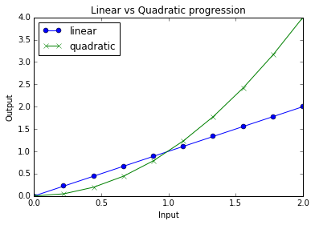
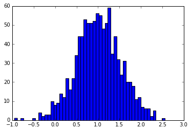
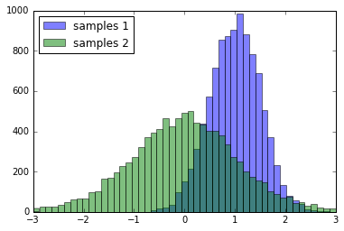
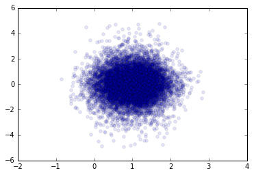

## Tutorial Setup

### Check your install


```python
import numpy
```


```python
import scipy
```


```python
import matplotlib
```


```python
import sklearn
```


```python
import psutil
```


```python
import pandas
```


```python
import IPython.parallel
```

    /usr/local/lib/python2.7/dist-packages/IPython/parallel.py:13: ShimWarning: The `IPython.parallel` package has been deprecated. You should import from ipyparallel instead.
      "You should import from ipyparallel instead.", ShimWarning)


Finding the location of an installed package and its version:


```python
numpy.__path__
```


    ['/usr/local/lib/python2.7/dist-packages/numpy']


```python
numpy.__version__
```


    '1.10.1'


### Check that you have the datasets


```python
%run ../fetch_data.py
```

    Using existing dataset folder:/home/janus/21_perspective/github/21v-python/unit_20/parallel_ml_tutorial-master/datasets
    Checking availability of the 20 newsgroups dataset
    Found archive: /home/janus/21_perspective/github/21v-python/unit_20/parallel_ml_tutorial-master/datasets/20news-bydate.tar.gz
    Checking that the 20 newsgroups files exist...
    => Success!


```python
import os
for fname in os.listdir('../datasets/'):
    print(fname)
```

    20news-bydate.tar.gz
    20news-bydate-train
    20news-bydate-test


## A NumPy primer

### NumPy array dtypes and shapes


```python
import numpy as np
```


```python
a = np.array([1, 2, 3])
```


```python
a
```


    array([1, 2, 3])


```python
b = np.array([[0, 2, 4], [1, 3, 5]])
```


```python
b
```


    array([[0, 2, 4],
           [1, 3, 5]])


```python
b.shape
```


    (2, 3)


```python
b.dtype
```


    dtype('int64')


```python
a.shape
```


    (3,)


```python
a.dtype
```


    dtype('int64')


```python
np.zeros(5)
```


    array([ 0.,  0.,  0.,  0.,  0.])


```python
np.ones(shape=(3, 4), dtype=np.int32)
```


    array([[1, 1, 1, 1],
           [1, 1, 1, 1],
           [1, 1, 1, 1]], dtype=int32)


### Common array operations


```python
c = b * 0.5
```


```python
c
```


    array([[ 0. ,  1. ,  2. ],
           [ 0.5,  1.5,  2.5]])


```python
c.shape
```


    (2, 3)


```python
c.dtype
```


    dtype('float64')


```python
a
```


    array([1, 2, 3])


```python
d = a + c
```


```python
d
```


    array([[ 1. ,  3. ,  5. ],
           [ 1.5,  3.5,  5.5]])


```python
d[0]
```


    array([ 1.,  3.,  5.])


```python
d[0, 0]
```


    1.0


```python
d[:, 0]
```


    array([ 1. ,  1.5])


```python
d.sum()
```


    19.5


```python
d.mean()
```


    3.25


```python
d.sum(axis=0)
```


    array([  2.5,   6.5,  10.5])


```python
d.mean(axis=1)
```


    array([ 3. ,  3.5])


### Reshaping and inplace update


```python
e = np.arange(12)
```


```python
e
```


    array([ 0,  1,  2,  3,  4,  5,  6,  7,  8,  9, 10, 11])


```python
f = e.reshape(3, 4)
```


```python
f
```


    array([[ 0,  1,  2,  3],
           [ 4,  5,  6,  7],
           [ 8,  9, 10, 11]])


```python
e
```


    array([ 0,  1,  2,  3,  4,  5,  6,  7,  8,  9, 10, 11])


```python
e[5:] = 0
```


```python
e
```


    array([0, 1, 2, 3, 4, 0, 0, 0, 0, 0, 0, 0])


```python
f
```


    array([[0, 1, 2, 3],
           [4, 0, 0, 0],
           [0, 0, 0, 0]])


### Combining arrays


```python
a
```


    array([1, 2, 3])


```python
b
```


    array([[0, 2, 4],
           [1, 3, 5]])


```python
d
```


    array([[ 1. ,  3. ,  5. ],
           [ 1.5,  3.5,  5.5]])


```python
np.concatenate([a, a, a])
```


    array([1, 2, 3, 1, 2, 3, 1, 2, 3])


```python
np.vstack([a, b, d])
```


    array([[ 1. ,  2. ,  3. ],
           [ 0. ,  2. ,  4. ],
           [ 1. ,  3. ,  5. ],
           [ 1. ,  3. ,  5. ],
           [ 1.5,  3.5,  5.5]])


```python
np.hstack([b, d])
```


    array([[ 0. ,  2. ,  4. ,  1. ,  3. ,  5. ],
           [ 1. ,  3. ,  5. ,  1.5,  3.5,  5.5]])


## A Matplotlib primer


```python
%matplotlib inline
```


```python
import matplotlib.pyplot as plt
```


```python
x = np.linspace(0, 2, 10)
```


```python
x
```


    array([ 0.        ,  0.22222222,  0.44444444,  0.66666667,  0.88888889,
            1.11111111,  1.33333333,  1.55555556,  1.77777778,  2.        ])


```python
plt.plot(x, 'o-');
```


```python
plt.plot(x, x, 'o-', label='linear')
plt.plot(x, x ** 2, 'x-', label='quadratic')

plt.legend(loc='best')
plt.title('Linear vs Quadratic progression')
plt.xlabel('Input')
plt.ylabel('Output');
```





```python
samples = np.random.normal(loc=1.0, scale=0.5, size=1000)
```


```python
samples.shape
```


    (1000,)


```python
samples.dtype
```


    dtype('float64')


```python
samples[:30]
```


    array([ 0.9723313 ,  1.05145447,  0.31986674, -0.26642655,  1.79545186,
            0.89663891, -0.78769912,  0.67095478,  1.28211239,  0.66237962,
            1.12488518,  1.76541164,  0.69160337,  0.05183348,  0.64934675,
            1.38717818,  0.37051531,  0.52509259,  1.17117495,  1.8224232 ,
            0.97875658,  1.60924242,  1.09170888,  0.40106831,  1.06174804,
            0.54542997,  1.21400516,  1.11310423, -0.1808943 , -0.36915236])


```python
plt.hist(samples, bins=50);
```





```python
samples_1 = np.random.normal(loc=1, scale=.5, size=10000)
samples_2 = np.random.standard_t(df=10, size=10000)
```


```python
bins = np.linspace(-3, 3, 50)
_ = plt.hist(samples_1, bins=bins, alpha=0.5, label='samples 1')
_ = plt.hist(samples_2, bins=bins, alpha=0.5, label='samples 2')
plt.legend(loc='upper left');
```





```python
plt.scatter(samples_1, samples_2, alpha=0.1);
```





```python

```


```python

```


```python

```


```python

```
